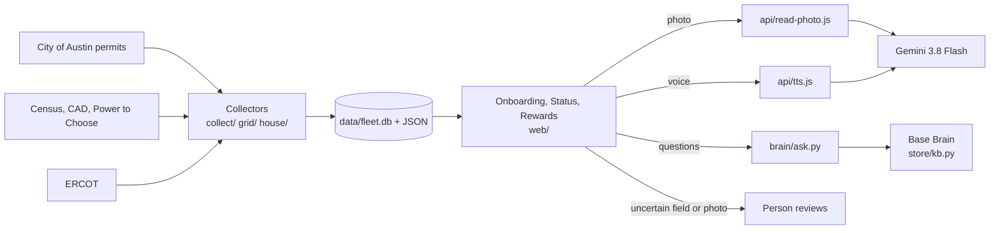
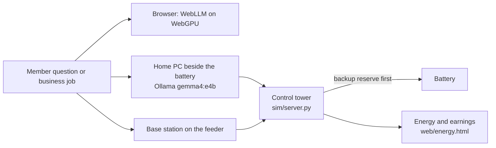

# Base Power × AITX hackathon entry

Built at the Base Power × AITX Talent Hackathon, Sep 25 to 27, 2026. Two entries share this repo. Start at the [landing page](https://base-aitx.vercel.app/web/start.html).

Demo videos: [Base Ready](https://www.loom.com/share/5cce9ad808a84c73a7346e334cf5e019) · [Base Super Local AI](https://www.loom.com/share/37a225004ab248bc874401470ef2653d).

## What we built for Track 2, Orchestration: Base Ready

Goal: take a member from a home address to an installed battery without a phone call.

- **Records-first onboarding.** The member types an address. City of Austin permits, ERCOT and Census data fill most fields, and three guided steps ask only what the records miss. [Onboarding](https://base-aitx.vercel.app/web/onboarding.html#home)
- **Points for each step.** 10 per answer, 20 for the photo, 30 for finishing, 50 per neighbour who joins. The member can redeem points for bill credit (our proposal). [Rewards](https://base-aitx.vercel.app/web/rewards.html)
- **Photo check with a person in the loop.** Gemini reads one guided photo, a quality check blocks blurry shots, and a person reviews anything uncertain. [Onboarding, photo step](https://base-aitx.vercel.app/web/onboarding.html#home)
- **Voice guide.** One question at a time, with pre-rendered Kokoro audio. [Voice guide](https://base-aitx.vercel.app/web/voice.html)
- **Application status.** The member sees where the application stands. [Status](https://base-aitx.vercel.app/web/status.html)
- **Help at any hour.** Base Brain answers from 88 curated FAQs and 168 linked sources. [Help](https://base-aitx.vercel.app/web/brain.html) · [The knowledge behind it](https://base-aitx.vercel.app/web/knowledge.html)
- **Views for Base.** Where ready homes concentrate, the permits behind them, and ERCOT price and load insights. [Market](https://base-aitx.vercel.app/web/market.html) · [ERCOT grid](https://base-aitx.vercel.app/web/grid.html)

## What we built for Track 3, Most Commercializable: Base Super Local AI

Goal: a private AI assistant for each member, on a small computer beside the battery. The member's data stays in the home.

- **The pitch, with a live ask box.** [Pitch](https://base-aitx.vercel.app/web/pitch.html)
- **Try it.** Run the local AI in the browser, or install it on a home PC with one command. [Try it](https://base-aitx.vercel.app/web/models.html)
- **Three plans: Use, Host, Sell.** A member uses the AI, hosts a GPU for shared earnings, or Base sells spare GPU time to local businesses. [Plans](https://base-aitx.vercel.app/web/plans.html)
- **Energy and credits.** The backup reserve always comes first. [Energy](https://base-aitx.vercel.app/web/energy.html)
- **Control tower.** Runs jobs by priority and moves them when a node fails, without touching the reserve (simulation). [Control tower](https://base-aitx.vercel.app/web/tower.html)

## Quick start

Needs Python 3.11+ (standard library only). Node 20+ only for the tests.

```sh
git clone https://github.com/jravinder/base-aitx && cd base-aitx
python3 -m http.server 8741                  # serve the static site from the repo root
open http://localhost:8741/web/start.html    # pages run on the checked-in JSON; no keys needed
```

Optional pieces:

```sh
cp .env.example .env && set -a && source .env && set +a   # add GEMINI_API_KEY
python3 -m brain.ask --serve 8742    # Help / Base Brain answers and photo reading on localhost
bash scripts/install-local.sh        # Super Local AI on your own PC, with Ollama
python3 -m sim --nodes 50 --seed 7   # rerun the fleet simulation -> out/report.json, out/report.md
python3 -m sim.server --port 8732    # live control tower: http://localhost:8732/tower.html
python3 grid/insights.py             # rerun the ERCOT analysis
```

## Reproduce the demo

1. Serve the site (Quick start). The demo path: `/web/start.html` → Base Ready → onboarding: confirm one of the 40 Austin homes, answer what records miss, upload a photo (samples in `demo/photos/`), then Rewards and Status. Base Super Local AI: `/web/compute-home.html` → Try it (a model runs in your browser with WebGPU, or on your PC after `scripts/install-local.sh`), Plans, Energy, Control tower.
2. Photo reading and the Gemini voice need `GEMINI_API_KEY`. On localhost, run `brain.ask` (above); on Vercel, set the key in the project and `api/read-photo.js` and `api/tts.js` use it server-side. Without a key, the photo step falls back to a person-review note and the voice guide to recorded clips and the browser voice.
3. Environment variables: see [.env.example](.env.example). Keys stay server-side; nothing is sent from the browser to Gemini directly.
4. Tests: `npm i -D playwright && npx playwright install chromium`, then `node tests/<name>.cjs`; Python tests: `python3 -m pytest tests/`.

## Tech stack and architecture

- **Pages:** static HTML, Tailwind (CDN) and vanilla JS in `web/`, one shared shell (`web/shell.js`), styles from a Stitch design.
- **Data:** stdlib Python collectors (`collect/`, `grid/`, `house/`) write JSON and one SQLite store (`store/build.py` → `data/fleet.db`). Pages read small JSON files, so they work without a server.
- **Answers:** `brain/ask.py` answers in a fixed order: recorded answer, route policy questions to Base, Base Brain knowledge base (`store/kb.py`), template, then a local model (Ollama, `gemma4:e4b`).
- **Photo and voice:** Gemini 3.8 Flash reads the photo (`api/read-photo.js`); voice is recorded Kokoro clips (`web/audio`), then Gemini TTS (`api/tts.js`), then the browser voice.
- **Super Local AI:** in the browser, WebLLM (MLC) runs a small open model on WebGPU with no install (`web/models.js`); on a home PC, `scripts/install-local.sh` sets up Ollama with `gemma4:e4b` (9.6 GB, one time), and the same answer server runs against it.
- **Control tower and simulation:** `sim/` models the fleet (nodes, jobs, backup reserve floor, earnings, failover); `sim/server.py` runs it live for the control tower; `grid/library_node.py` models a neighbourhood station.
- **Hosting:** Vercel (static files + two serverless functions). GA4 for page views.

**Base Ready**



**Base Super Local AI**



## Datasets and provenance

Every number on a page names its source file and a tag: **Measured** (we ran it or counted it in public data), **Simulation** (our model, with its dials named), **Our design** (a choice, not a measurement). The full list with URLs is in [web/data/sources.json](web/data/sources.json) and on each page's Data sources strip.

| Data | Source | Kind |
|---|---|---|
| Building and electrical permits (the 40 demo homes, market counts) | City of Austin Open Data, Socrata `3syk-w9eu` | Public |
| Prices, load, fuel mix | ERCOT dashboards and DAM/RTM archive (report 13060), load history | Public |
| Households, income | U.S. Census ACS 5-year (Census Reporter), TIGERweb ZCTAs | Public |
| Year built, appraisal | Travis and Williamson appraisal districts | Public |
| Retail plans | Power to Choose (PUCT) | Public |
| Weather alerts | National Weather Service | Public |
| Substations, libraries, rec centres, schools | OpenStreetMap, Austin Public Library, City of Austin, TEA | Public |
| FAQ corpus | Base Power public site and help centre, copied by hand | Public |
| GPU and token prices | RunPod, Lambda, Together AI pricing pages (2026-09-26) | Public |
| Local vs cloud answers, permit judgments, data QA | Our runs (`brain/LOCAL_VS_CLOUD.md`, `store/`) | Measured |
| Fleet, earnings, onboarding funnel, easy-fit funnel | Our simulations (`sim/`, `grid/`) | Simulation (synthetic) |
| Demo photos | Openly licensed images, see `demo/photos/ATTRIBUTION.md` | Public |

The 40 demo homes are real Austin addresses from public permit records; there are no owner names. Answers, points and photos a visitor adds stay in that browser.

## How permit routing works

The Permits page ([web/judgments.html](web/judgments.html)) gives every Austin energy permit a category and a confidence. The confidence sets the route.

**Data.** 34,334 City of Austin energy permits (Socrata `3syk-w9eu`), issued 2015-01-02 to 2026-09-25, mirrored to `data/mirror/energy_permits.csv.gz` by `house/mirror.py`. The mirror holds no owner names, addresses or descriptions.

**Seven rules** (`house/mirror.py` `categorize`, confidence in `store/judgments.py` `RULE_CONFIDENCE`):

| Rule | Confidence | Route | Permits |
|---|---|---|---|
| work_class Auxiliary Power agrees with a battery or PV keyword | 0.95 | auto | 18,100 |
| work_class Upgrade plus an upgrade keyword | 0.92 | auto | 4,536 |
| a specific term (battery, Powerwall, generator, EV charger), work_class neutral | 0.87 | auto | 7,242 |
| solar via PV or modules plus inverter, work_class not Auxiliary Power | 0.80 | review | 1,590 |
| upgrade or 200 amp wording, work_class not Upgrade | 0.75 | review | 1,402 |
| keyword and work_class Auxiliary Power point to different things | 0.72 | review | 43 |
| no rule matched (other_electrical) | 0.40 | person | 1,421 |

**Routes.** Confidence 0.85 or more goes to auto. Confidence from 0.70 up to 0.85 goes to model review. Below 0.70, a person checks the permit. Result: 34,334 judged, 29,878 auto, 3,035 review, 1,421 to a person.

**Hand check.** 150 permits were checked by hand against the rule category (`data/mirror/category_check.csv`): 143 of 150 were right. The weakest were other_electrical (14 of 17) and panel_upgrade (25 of 28).

**Local model check.** `gemma4:e4b`, run locally with Ollama, re-judged the 100 permits with the lowest rule confidence. It agreed with the rules on 8 of 100, but it gave a confidence of 0.90 or more on 99 of them. It labelled 91 of them as panel upgrades. Two of those permits are also in the hand check, and the model was wrong on both. So a model's own confidence does not route permits: those permits still go to a person.

**Rebuild** (from the repo root):

```sh
python3 -m house.mirror --incremental                 # refresh the permit mirror (network)
python3 store/build.py                                # load the mirror into data/fleet.db
python3 -m store.judge --backend gemma --sample 100   # optional: local model re-judge (needs Ollama + gemma4:e4b)
python3 -m store.judgments                            # write web/data/judgments.json
python3 web/data/build_permit_jev.py                  # write web/data/permit_jev.json (the page's figures)
```

**Tests.** `python3 -m pytest tests/test_permit_routing.py` checks that the mirror plus the rules reproduce the counts in both JSON files, and that the hand-check and model-agreement totals add up.

## ERCOT pipeline

A reproducible warehouse for ERCOT market data plus fleet-scale battery telemetry, in DuckDB. It answers one question: **when is a Base battery worth the most?** The results are on the first screen of `web/grid.html`.

**Rebuild:** `python3 -m warehouse.build` takes about 64 s on an 8-core laptop. It runs ingest, then simulate, then the models, then the schema tests, then the quality checks, then the export. Every table is create-or-replace, and a raw zip is re-parsed only when its sha256 changes, so the build is idempotent. `--fetch` downloads any zip that is missing. `--resim` regenerates the telemetry.
Needs `duckdb`, `pyarrow`, `numpy`, `scipy`, `pyyaml` and `python-calamine` (`pip install --user ...`).
**Tests:** `python3 -m pytest tests/test_warehouse.py` (17 tests). These cover DST conversion, the dispatch LP, the schema tests, the quality checks, fault detection and the export.
**dbt:** the same SQL is a dbt-duckdb project in `warehouse/dbt`. Run `cd warehouse/dbt && ../../.venv/bin/dbt build --profiles-dir .` (92/92 pass), `dbt source freshness` and `dbt docs generate` (lineage). `warehouse/runner.py` runs the same files without dbt: it handles ref, source, config, Python models and the same schema.yml tests.

### Sources (public, no login)
| source | what | raw rows |
|---|---|---|
| ERCOT report 13060, `DAMLZHBSPP_2025/2026.zip` | DAM hourly prices, all hubs and load zones, 2025-01-01 to 2026-09-26 | 228,225 |
| ERCOT report 13061, `RTMLZHBSPP_2025/2026.zip` | RTM 15-minute settlement point prices (LZ and LZEW types) | 1,399,780 |
| ERCOT report 13091, `DAMASMCPC_2025/2026.zip` | DAM ancillary service clearing prices: RegUp, RegDn, RRS, ECRS, Non-Spin | 15,215 |
| `data/ercot_load_hourly_2024_2026.csv` | ERCOT native load by weather zone (grid/LOAD.md) | 23,375 |
| `warehouse/fleet_sim.py` | **Simulation.** 1,000 batteries, 1-minute telemetry for 30 days (2026-01-12 to 2026-02-10), driven by the real RTM and DAM prices, with a reserve-first dispatch policy and injected faults | 43,063,505 |

The zips are in `data/ercot/raw/`, with their doclookupIds in `warehouse/ingest.py`. Generated files go to `data/warehouse/` (gitignored). Telemetry is stored as Parquet, partitioned by day (263 MB).

### Layers and tables
- **raw**: the archives parsed to Parquet with every column as published, including the DST repeated-hour flag.
- **staging** (`stg_ercot__dam_spp`, `__rtm_spp`, `__as_prices`, `__load`, `__dam_legacy`, `stg_fleet__devices`, `__telemetry`): typed, with `interval_start_utc` and `interval_start_local` side by side. Hour ending is normalised to an interval start. The DST macro `chicago_to_utc` resolves the repeated fall-back hour (flag Y, or `02:00 DST` in the load file) and spring-forward days have 23 hours.
- **intermediate**:
  - `int_market__zone_hourly`: DAM price, load and AS prices per hour.
  - `int_market__battery_dispatch` and `__battery_dispatch_rt`: Python models. A perfect-foresight LP per day using scipy HiGHS: 39.2 kWh, 10 kW, 90% round trip, at reserve floors from 0 to 50%.
  - `int_market__revenue_stack`: energy and AS co-optimised, with energy backing per service.
  - `int_market__hourly_value`.
  - `int_fleet__device_clock`: per-device clock offset.
  - `int_fleet__telemetry_minute`: clock-corrected, deduplicated and range-cleaned. 42.9M rows.
- **marts**: `mart_market__price_heatmap`, `__price_concentration`, `__concentration_curve`, `__spike_hours`, `__battery_value_daily`, `__battery_value_monthly`, `__reserve_cost`, `__revenue_stack`, `__load_vs_price`, and `mart_fleet__hourly`, `__soc_daily`, `__spike_availability`, `__device_health`.

### Quality checks (`warehouse/quality.py`: `dq_results` table + `data/warehouse/dq_report.json`)
- Gaps in every hourly and 15-minute series.
- Duplicates.
- DST days: 23 or 25 hours, with the expected count taken from the tz database.
- Price bounds of -$251 to the $5,000 offer cap. Negative prices are allowed.
- AS price bounds.
- Load bounds of 25 to 95 GW.
- Zone sums: SCENT + NCENT + COAST must not exceed the ERCOT total.
- The legacy CSV must match the re-ingested archive: 45,138 of 45,138 hours do.
- DAM, RTM and AS must cover the same days.
- Freshness.
- For the fleet: orphan rows, duplicates, stale devices, gaps, out-of-range readings, clock skew, stuck temperature, stuck SOC and reserve breaches.

Current run: 63/63 schema tests pass. Quality checks: **22 pass, 11 warn, 0 fail**. The 11 warnings are:
- **Freshness:** ERCOT posts these archives weekly, so DAM, RTM and AS are 5.8 days old. Load is 31.8 days old.
- **The faults the simulator injected:** 129,108 duplicate rows, 5 stale devices, 19 skewed clocks, 6 stuck temperature sensors and 3 stuck SOC sensors.

The fleet checks are scored against the injected faults: **34 of 34 caught, 0 false positives**.

### Numbers (one 39.2 kWh battery, LZ_AEN, last 365 days = 2025-09-27 to 2026-09-26)
| | value | tag |
|---|---|---|
| Arbitrage value a year at a 30% reserve floor (perfect-foresight DAM) | $523 (2025: $613) | Upper bound |
| Share of that value earned in the top 1% of hours (88 hours) / top 5% | 22% / 51% | Upper bound |
| Cost of the reserve: 0% → 30% → 50% floor | $667 → $523 → $402 a year ($144 / $265) | Upper bound |
| Energy plus ancillary services at a 30% floor (capacity payments only) | $689 (+$166 over energy alone) | Upper bound |
| Real-time 15-minute arbitrage compared with day-ahead | 1.30x | Upper bound |
| Top-100 load hours that were also top-100 price hours, 2025 | 2 of 100; correlation 0.38 | Measured |
| Fleet online, grid-up and above its floor during RT intervals at $250 or more | 95.6% (83.8% at other times) | Simulation |

The perfect-foresight LP gives $613 for 2025. The `grid/earned.py` heuristic (3 cheapest hours, 3 dearest hours, no losses) gives $603. A real forecast-driven dispatch would earn less than either.

Throughput: 43.06M telemetry rows are clock-corrected and deduplicated in 8.5 s, which is about 5M rows/s.
The ceiling is higher. The day partitions are written time-major, so the dedup window needs a full sort. Sorting each partition by device_id and timestamp would let it stream, likely at 3 to 5x the rate. The 21 s LP stack could also run per zone in parallel.

## Known limitations

- The demo covers 40 preset Austin homes, not any address.
- Target PC speed is not yet measured on the Windows-class PC beside the battery (#80).
- One PC's power draw is unresolved: 0.4 kW in the fleet sim vs 350 W in the hub model (#85).
- 40% GPU use is a dial we set, not a measured demand number; earnings and savings are Simulation.
- There is no hyperscaler price in the comparison yet; the measured public rate is RunPod.
- Amps read from outside-the-panel photos are rarely readable; a person confirms breaker size.
- The hand-off to a person is shown, not staffed: a photo for review is saved in the browser only.
- Points and bill credit are our proposal, not a Base program. Base's real lead-to-install drop rate is unknown.

## Next steps

- Any Austin address: look up permits live from Socrata instead of the preset 40.
- Measure speed and power on the target PC (#80, #85) and run the member AI with the internet unplugged on battery.
- Add a hyperscaler GPU price to the comparison.
- Real reviewer queue for photos, during Base hours.
- Log 30 days of job arrivals at one pilot hub to replace the 40% GPU dial.

## Demo photos

See [demo/photos/ATTRIBUTION.md](demo/photos/ATTRIBUTION.md) for sourcing and licenses.

## Docs

- [docs/BUILT.md](docs/BUILT.md) — what we built, row by row
- [docs/SUBMISSION.md](docs/SUBMISSION.md) — the submission writeup
- [docs/GRID_INSIGHTS.md](docs/GRID_INSIGHTS.md) — ERCOT findings
- [docs/COMPUTE_PLANS.md](docs/COMPUTE_PLANS.md) — compute plans and rate card
- [docs/DATAFLOW.md](docs/DATAFLOW.md) — data flow
- [docs/GAPS.md](docs/GAPS.md) — open gaps
- [docs/KNOWLEDGE_BASE.md](docs/KNOWLEDGE_BASE.md) — Base Brain knowledge base
- [docs/LEARNING.md](docs/LEARNING.md) — what we learned
- [docs/VIDEO.md](docs/VIDEO.md) — video script
- [docs/adr/](docs/adr/) — architecture decision records

---

Built by [Ravinder Jilkapally](https://www.linkedin.com/in/jravinder/) · [aisoft.us](https://aisoft.us)
